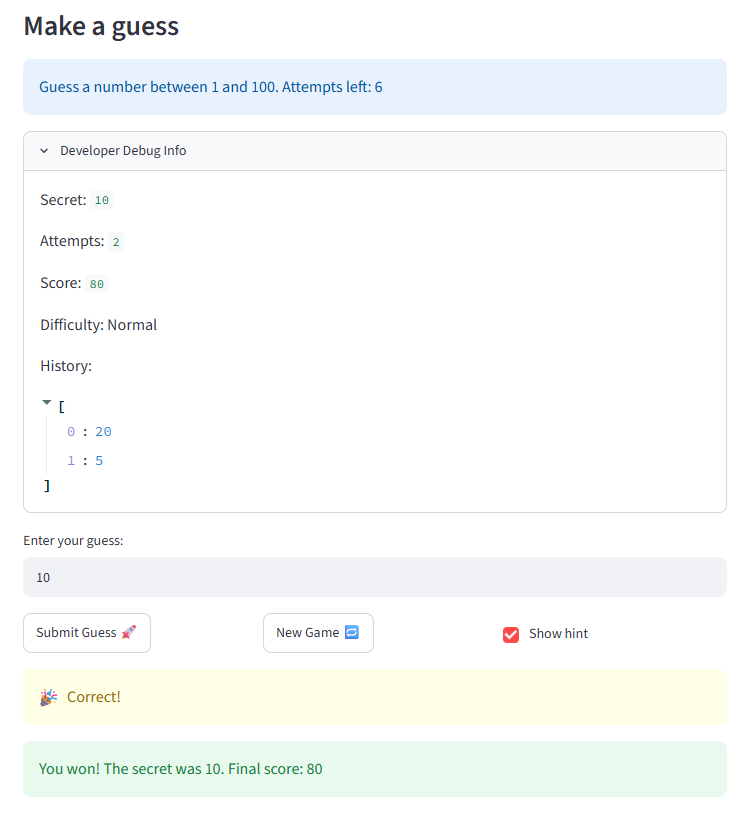

# 🎮 Game Glitch Investigator: The Impossible Guesser

## 🚨 The Situation

You asked an AI to build a simple "Number Guessing Game" using Streamlit.
It wrote the code, ran away, and now the game is unplayable. 

- You can't win.
- The hints lie to you.
- The secret number seems to have commitment issues.

## 🛠️ Setup

1. Install dependencies: `pip install -r requirements.txt`
2. Run the broken app: `python -m streamlit run app.py`

## 🕵️‍♂️ Your Mission

1. **Play the game.** Open the "Developer Debug Info" tab in the app to see the secret number. Try to win.
2. **Find the State Bug.** Why does the secret number change every time you click "Submit"? Ask ChatGPT: *"How do I keep a variable from resetting in Streamlit when I click a button?"*
3. **Fix the Logic.** The hints ("Higher/Lower") are wrong. Fix them.
4. **Refactor & Test.** - Move the logic into `logic_utils.py`.
   - Run `pytest` in your terminal.
   - Keep fixing until all tests pass!

## 📝 Document Your Experience

- [ ] Describe the game's purpose.
- [ ] Detail which bugs you found.
- [ ] Explain what fixes you applied.

## 📸 Demo Walkthrough

Describe your fixed game in numbered steps so a reader can follow along without watching a video:

1. User enters a guess of 40
2. Game returns hints "Go HIGHER"
3. User enters a guess of 80
4. Game returns hints "Go HIGHER"
5. User enters a guess of 85
6. Game returns hints "Go LOWER"
5. User enters a guess of 84
6. Game returns "Correct"
7. Score updates correctly after each guess (start with 100, reduce 10 if guess wrong, not reduce any score if it is correct)
8. Game ends after the correct guess

**Screenshot** *(optional)*: <!-- Insert a screenshot of your fixed, winning game here -->


## 🧪 Test Results

```
# Paste your pytest output here, e.g.:
# pytest tests/
# ========================= X passed in 0.XXs =========================
```
============================================================== test session starts ==============================================================
platform win32 -- Python 3.12.6, pytest-8.4.2, pluggy-1.6.0
rootdir: C:\Users\dingr\Desktop\Works\codepath\ai110-module1show-gameglitchinvestigator-starter\tests
plugins: anyio-4.7.0, langsmith-0.8.7, mock-3.15.1
collected 18 items                                                                                                                               

test_game_logic.py ..................                                                                                                      [100%]

============================================================== 18 passed in 0.06s ===============================================================

## 🚀 Stretch Features

- [ ] [If you choose to complete Challenge 4, describe the Enhanced UI changes here — a screenshot is optional]
